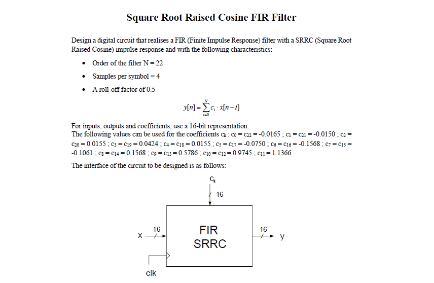

# Square Root Raised-Cosine Filter (FIR): Digital Circuit FPGA Implementation

Electronics & Communication Systems Project at University of Pisa - MSc Computer Engineering.

## Overview Description

This project involved the design and implementation of a symmetric FIR digital filter with SRRC response using VHDL hardware description. The primary objective was to develop an efficient fixed-point architecture that ensures numerical precision while avoiding overflow, with a strong focus on resource optimization. After writing and functionally verifying the architecture through a dedicated testbench in ModelSim, a co-simulation with Python was performed to validate the filter's numerical behavior. The design was then synthesized and implemented using Vivado, where a complete analysis was carried out regarding timing, resource utilization, and power consumption. This end-to-end workflow enabled the development of a compact and robust digital design, suitable for future FPGA deployment, fully compliant with timing constraints and offering a comprehensive view of the entire digital design cycle—from modeling to post-synthesis analysis.

## Project Assignment



## Required Software and Frameworks

To develop, simulate, and implement the proposed digital filter system, the following tools and environments must be installed

### Visual Studio Code (VSCode)

Visual Studio Code is a lightweight yet powerful source code editor widely used for Python development. It enables efficient code execution and debugging.

**Installation:**

1. Visit the [VSCode download page](https://code.visualstudio.com/Download).
2. Follow instructions for your operating system.
3. After installation, add Python and Jupyter extensions to enhance development.

### Python with Required Packages

Python is the primary programming language used for SRRC filter simulation and analysis.

The **essential Python packages** for this project are:

* **`fxpmath`**: Crucial for fixed-point arithmetic modeling, enabling simulation of hardware filter behavior in terms of precision and overflow.
* **`scipy.signal`**: Provides signal processing functions like `upfirdn` for upsampling and filtering, critical for SRRC pulse generation and convolution.
* **`matplotlib`**: Used for visualizing simulation results, such as frequency response and time-domain filter behavior.
* **`numpy`**: Fundamental for high-performance numerical operations and multidimensional array handling, forming the basis for signal data and filter coefficient manipulation.

**Installation (via `pip`):**

1. Ensure Python is installed (Python 3.x recommended).
2. Open your terminal or command prompt.
3. Install packages using:
    ```bash
    pip install fxpmath scipy matplotlib numpy
    ```

### ModelSim

ModelSim is a leading HDL (Hardware Description Language) simulation environment used to verify SRRC filter VHDL code behavior. It enables testbench execution and waveform analysis of hardware signals.

To properly run the compilation and simulation on Modelsim use the files contained in the src and modelsim/tb directory

**Installation:**

1. Download ModelSim or QuestaSim from the [Intel](https://fpgasoftware.intel.com/) official websites.
2. Follow the installation instructions based on your OS.

### Vivado Design Suite

Vivado Design Suite is Xilinx's (AMD) integrated development environment (IDE) for FPGA synthesis and implementation. Required for mapping VHDL filter designs to specific FPGA hardware, generating bitstreams, and analyzing hardware resource utilization.

**Installation:**

1. Download Vivado from AMD Xilinx's website.
2. Select the appropriate OS version and follow installation instructions. The free WebPACK edition may suffice for basic needs.

## Documentation Report

You can find more details about the work related to this project by reading the **Report** appropriately wrote to summarize it by clicking on this link [Square Root Raised-Cosine Filter (FIR): Digital Circuit FPGA Implementation](/docs/Report-SRRC-FIR_Filter.pdf).

## Author

* Gaetano Sferrazza - *e-mail*: g.sferrazza@studenti.unipi.it - *GitHub Profile*: [ [@g-sferr](https://github.com/g-sferr) ]


